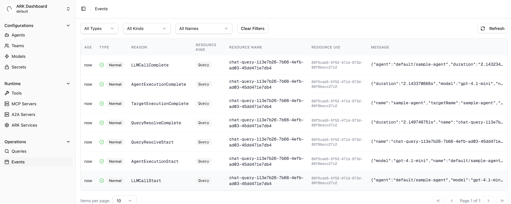
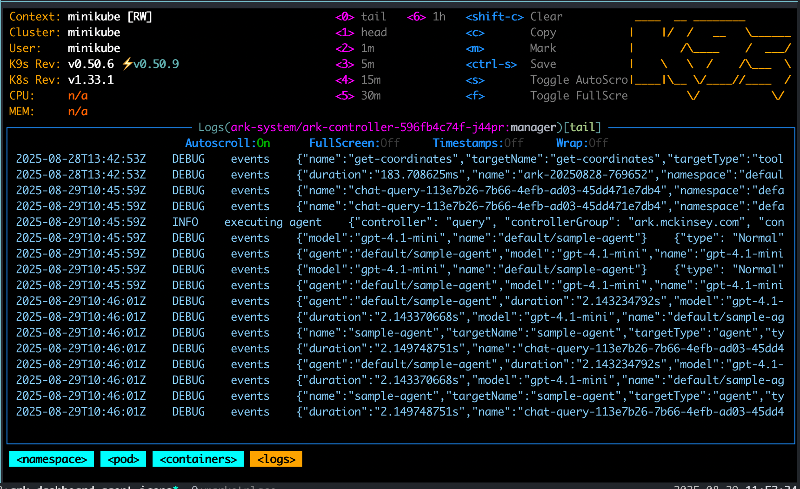
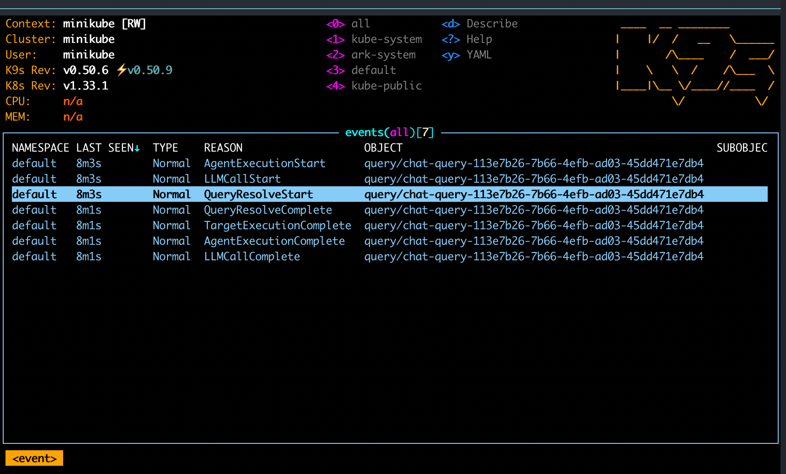

# Logging and Events

Ark diagnostics and informational logging is handled in two ways; either via direct logging in the code or raising events. The 'Events' page on the dashboard can be used to view and filter events:



And logs can be viewed in a number of ways, for example via `k9s`:



This guide covers how to view events and logs and best practices for raising events and log messages.

## Viewing Events

You can view events via `kubectl`:

```bash
# Show events for a specific resource
kubectl describe query my-query

# Show all events in namespace
kubectl get events --sort-by='.lastTimestamp'

# Show events for specific resource type
kubectl get events --field-selector involvedObject.kind=Query
```

You can also view events in `k9s` with the `:events` command:



And finally, events can be seen in the Events page in the Ark Dashboard.

## Viewing Logs

View the controller logs with:

```bash
# Controller logs
kubectl logs -f deployment/ark-controller-manager -n ark-system
```

Use the `--follow` parameter to tail logs. You can also view logs in `k9s` by going to the `ark-controller` pod in the `ark-system` namespace. There are many options to wrap, search, copy, etc. Use `k9s` and choose `:namespace` then `ark-system` and select the `ark-controller` pod:


## Event and Logging Guidelines

Use events for:

- User-facing information visible in `kubectl describe`
- State transitions and lifecycle events
- Successful completion of significant operations
- Error reporting that application owners need to see

As an example, query execution emits these events:

- `Normal/LLMCallComplete`: LLM call with token usage details
- `Normal/AgentExecutionComplete`: Agent execution completion with duration
- `Normal/TargetExecutionComplete`: Target execution completion

Use Logging For:

- Internal debugging and troubleshooting
- Detailed operational information
- Development insights

As an example, controllers log operational details:

```go
log.Info("Memory processed successfully", "memory", memory.Name, "address", resolvedAddress)
log.Error(err, "failed to resolve ExecutionEngine address", "executionEngine", executionEngine.Name)
```

## How to log events

Controllers with event recording include an `EventRecorder` field:

```go
// Event level constants
const (
    EventLevelNormal  = "Normal"
    EventLevelWarning = "Warning"
)

// Event recording in reconciler - follow {Resource}{Action}{State} convention
r.Recorder.Event(&query, EventLevelNormal, "QueryLLMCallComplete", eventData)
r.Recorder.Event(&query, EventLevelWarning, "QueryExecutionFailed", fmt.Sprintf("Error: %v", err))
```
