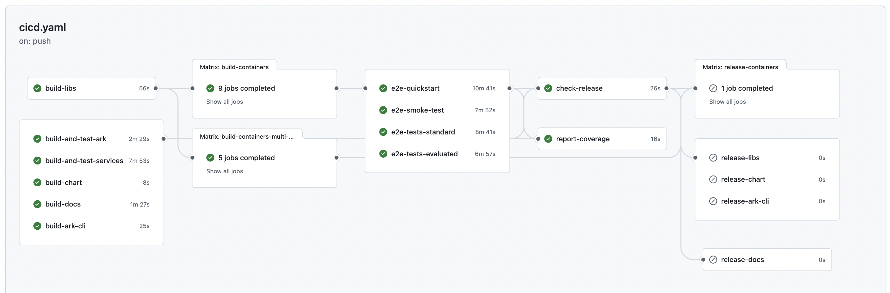

# Build Pipelines

## Pipelines

### CI/CD

The CI/CD pipeline builds and tests all ARK components, services, and documentation on every push. It includes library builds, single-platform container builds (AMD64) for testing, E2E testing, and release preparation.



### Deploy

The Deploy pipeline is run on demand to deploy:

- Documentation to GitHub Pages
- Multi-arch Containers to the configured container registry
- ARK CLI to NPM registry
- Ark to the configured distribution environment
- Ark to the configured AWS test environment
- Ark to the configured GKE test environment

The artifacts that are deployed can be selected when the pipeline is run, as well as the specific version tag to use.

### CI/CD

The CI/CD pipeline builds and tests all ARK components on every push. The Check Release job uses [Release Please](https://github.com/googleapis/release-please) to create or update a release pull request, changelog, and version number. When the release pull request is merged, the Deploy workflow runs automatically.

### Validate PR Title

Ensures pull request titles follow conventional commit format for consistent squash merge messages.

### SonarQube Code Analysis (SCAS)

Automated code quality and security analysis. Expected to fail in open source repositories as it requires McKinsey-specific infrastructure.

## Recommended GitHub Configuration

Configure repository settings to enforce conventional commits for automated release management:

- General → Pull Requests: Enable only squash merging
- Branches → Branch Protection: Require `validate-title` status check and linear history

## Configuration

GitHub variables and secrets for ARK build and deployment workflows. All configuration is **optional** - if not provided, workflows will default to using GitHub Container Registry (GHCR).

| Name | Type | Purpose | Default Value |
|------|------|---------|---------------|
| **Docker Registry (Production)** | | | |
| `DOCKER_REGISTRY` | Variable (Optional) | Main registry URL for version-tagged production/release images | `ghcr.io/{repository_owner}/{repository_name}` |
| `DOCKER_REGISTRY_USERNAME` | Secret (Optional) | Username for main registry authentication | `${{ github.actor }}` |
| `DOCKER_REGISTRY_PASSWORD` | Secret (Optional) | Password/token for main registry authentication | `${{ secrets.GITHUB_TOKEN }}` |
| **CI Cache Registry (Build Artifacts)** | | | |
| `DOCKER_CICD_CACHE_REGISTRY` | Variable (Optional) | Registry URL for SHA-tagged intermediate images and CI/CD build cache | `ghcr.io/{repository_owner}/{repository_name}` |
| `DOCKER_CICD_CACHE_REGISTRY_USERNAME` | Secret (Optional) | Username for CI cache registry authentication | `${{ github.actor }}` |
| `DOCKER_CICD_CACHE_REGISTRY_PASSWORD` | Secret (Optional) | Password/token for CI cache registry authentication | `${{ secrets.GITHUB_TOKEN }}` |
| **Azure OpenAI (Testing)** | | |
| `CICD_AZURE_OPENAI_KEY` | Secret | Azure OpenAI API key for E2E quickstart tests and evaluator | |
| `CICD_AZURE_OPENAI_BASE_URL` | Secret | Azure OpenAI base URL for E2E quickstart tests and evaluator | |
| **Distribution Environment Deployment** | | |
| `DEPLOY_CLUSTER_LOGIN_URL` | Secret | Kubernetes cluster login URL for centralized deployment environment | |
| `DEPLOY_CLUSTER_IDP_ISSUER_URL` | Secret | Identity provider issuer URL for cluster authentication | |
| **Documentation Site** | | |
| `DOCS_SITE_BASE_PATH` | Variable (Optional) | Base path for documentation site when serving from non-root URL (e.g., GitHub Pages) | |
| **NPM Registry (CLI Deployment)** | | |
| `NPM_TOKEN` | Secret (Optional) | NPM authentication token with publish permissions for CLI deployment | |
| **Code Quality and Analysis** | | |
| `SONAR_TOKEN` | Secret | SonarQube authentication token |
| `SONAR_HOST_URL` | Secret | SonarQube server URL |
| `ARTIFACTORY_USER` | Secret | Artifactory username for dependency resolution |
| `ARTIFACTORY_PASS` | Secret | Artifactory password for dependency resolution |

## Troubleshooting

### Uppercase Organization Names

Unless otherwise specified, GHCR is used as the default Docker container registry, with the value `ghcr.io/<org_name>`. Docker registry names must be lowercase. If your GitHub organization name contains uppercase characters, you must explicitly set the Docker registry secrets with lowercase values. For exampole, for the organization `My-Org`, set:

```yaml
DOCKER_REGISTRY: "ghcr.io/my-org" 
DOCKER_CICD_CACHE_REGISTRY: "ghcr.io/my-org"
```

### GitHub Pages Documentation Deployment
When deploying documentation to GitHub Pages, the site is served from a subpath (e.g., `mckinsey.github.io/agents-at-scale-ark`). To ensure assets load correctly, set the `DOCS_SITE_BASE_PATH` repository variable to match your repository name:

```yaml
DOCS_SITE_BASE_PATH: "/agents-at-scale-ark"
```

This configures the Next.js build to serve all assets from the correct subpath. Without this setting, CSS, JavaScript, and images will fail to load when deployed to GitHub Pages.
