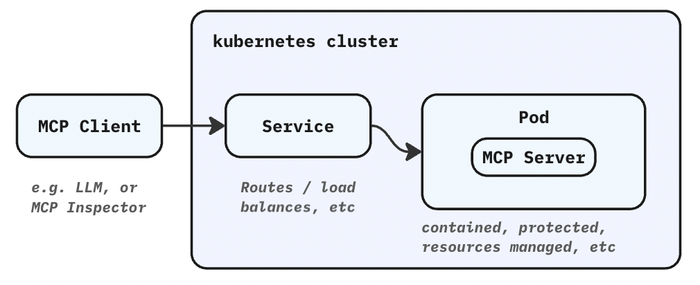
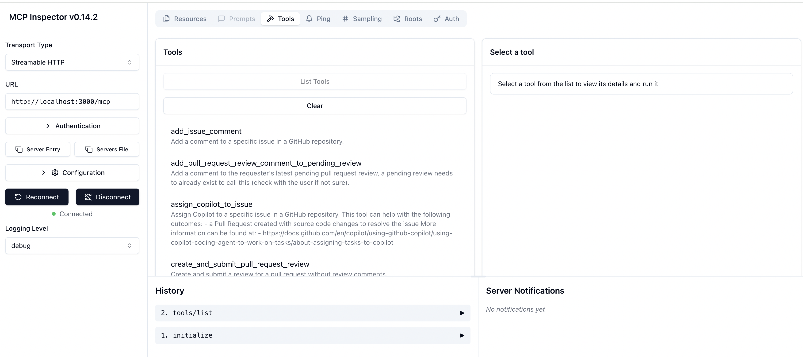
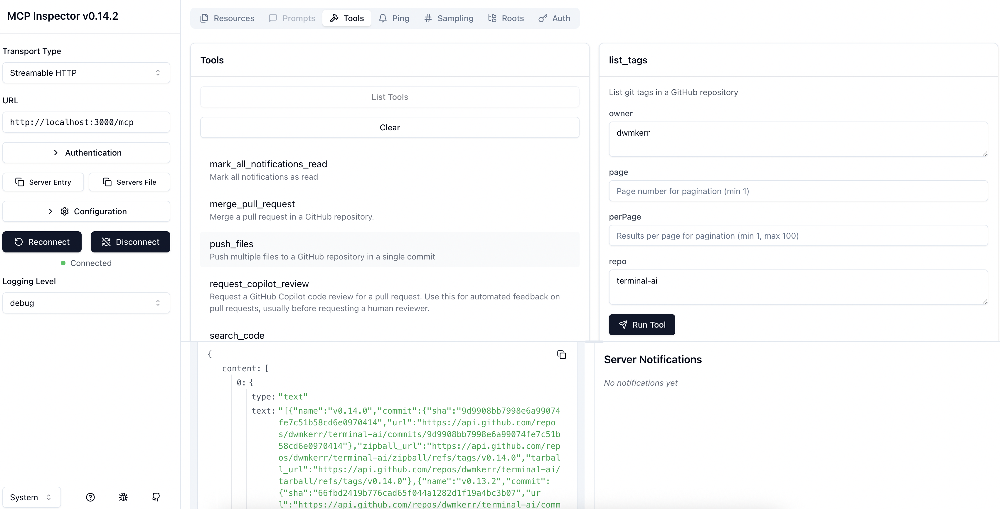

# MCP Servers

All common MCP Server configurations are supported in the platform:

- Externally hosted MCP Servers
- MCP Servers with stdio transport running in-cluster
- MCP Servers with HTTP transport running in-cluster
- MCP Servers running on the local host (great for development and testing)
- Building your custom MCP servers

For locally running servers, you have full isolation as they run in containers, scalability, resource constraints, secret management, configuration, and more.

## Accessing Externally Hosted MCP Servers

This sample shows how to create an `MCPServer` resource in your cluster that talks to an remote server hosted on another platform. We'll use the official [GitHub MCP Server](https://github.com/github/github) and connect it to an agent.

Deploy the remote MCP server with your GitHub Personal Access Token:

```bash
export GITHUB_PAT="your_token"
envsubst < samples/mcp/github-external-mcp-server-sample.yaml | \
kubectl apply -f -
```

This will substitute your GitHub PAT into the configuration and deploy the remote MCP server.

The [`samples/mcp/github-external-mcp-server-sample.yaml`](https://github.com/McK-Internal/qbaf/blob/main/samples/mcp/github-external-mcp-server-sample.yaml) file contains:

- A `Secret` GitHub Personal Access Token 
- An `MCPServer` that routes authenticated requests to the externally hosted Official GitHub MCP Server (at `https://api.githubcopilot.com/mcp/`)

Create Tool resources for the MCP server, then reference them in your agent:

```yaml
apiVersion: ark.mckinsey.com/v1alpha1
kind: Agent
metadata:
  name: github-remote-agent
  namespace: default
spec:
  prompt: You are a helpful AI assistant that interacts with GitHub resources.
  azureRuntime: azureruntime-sample
  tools:
    - type: custom
      name: github-get-repo  # References Tool that connects to github-remote-mcp
```

See [Tools](/reference/resources/tools) for creating Tool resources that connect to MCP servers.

Now run a query - if any tool calls are needed they'll be made and you'll get the results:

```bash
fark agent github-remote-agent 'whats my most popular repo?'
```

> Your most popular repository (by far) is hacker-laws – 26 k stars ⭐️ -  🧠 “Laws, Theories, Principles and Patterns for developers and technologists.”

The `Query` object will show all tool calls made.

## Hosting a stdio MCP Server In-Cluster

This sample shows how to create an MCP server, the example we'll use is the official [GitHub MCP Server](https://github.com/github/github). Note that like many MCP servers, this only supports `stdio` when running locally - but we'll work around this with a simple trick - using a proxy such as [`mcp-proxy`](https://github.com/sparfenyuk/mcp-proxy).

Now deploy the [`samples/mcp/github-stdio-mcp-server-sample.yaml`](https://github.com/McK-Internal/qbaf/blob/main/samples/mcp/github-stdio-mcp-server-sample.yaml) resources:

```bash
export GITHUB_PAT="your_token"
envsubst < samples/mcp/github-stdio-mcp-server-sample.yaml | \
kubectl apply -f -
```

This YAML file contains the resources needed for a scalable and ready-to-go MCP server:

- A `Secret` that contains the GitHub token used to talk to GitHub
- A `Deployment` that creates a single `Pod` that runs the GitHub MCP server
- A `Service` that exposes the MCP server to the cluster
- An `MCPServer` resource that ensures the MCP server is easily discoverable by other resources

There are a few resources here, that provide some essential operational capabilities:



Now take a look at your MCP server:

```bash
kubectl describe mcpserver github
```

To test the MCP server out, you can expose it to your local machine and then connect the MCP Inspector;

```bash
# Expose the GitHub MCP server to your local host.
kubectl port-forward svc/github 3000:80

# Now run the MCP Inspector, pointing at the forwarded MCP server.
# Make sure to use the "Streamable HTTP Transport".
npx @modelcontextprotocol/inspector http://localhost:3000/mcp
```

You'll be able to list the tools using the MCP Inspector:



You can make specific tool calls - the `GITHUB_PAT` that you provided has been set as a `Secret` in the cluster and is used by the hosted tool:



## Hosting an HTTP MCP Server In-Cluster

Note: This sample is work-in-progress, but very similar to the above, expect that the `mcp-proxy` is not even needed.

## Accessing a Local MCP Server

Accessing an MCP Server which is running on the local host can be extremely useful for debugging or quick-testing. You can have your MCP Server live-reload, update tools, and so on, without your cluster needing to know any of the details.

In this example, we'll run the "AI Developer Guide" MCP server in local development mode, with live-reload. First, clone the repo and start the local apis:

```bash
git clone git@github.com:dwmkerr/ai-developer-guide
cd ai-developer-guide
make site-build && make site-run
```

This runs the AI Developer Guide APIs locally on port 9090. Now we need to run its MCP server.

The server uses `stdio` transport. It is generally much safer to connect agents to MCP server s via HTTP, so that the MCP server doesn't run on the same host as the agent (which is a security and stability risk), so we can put a HTTP proxy in front of the server.

Run [`mcp-proxy`](https://github.com/sparfenyuk/mcp-proxy) and start the MCP server in HTTP SSE mode:

```bash
# Go to the MCP server folder.
cd mcp/ai-developer-guide-mcp

# Install dependencies and install the MCP proxy.
npm install
pipx install mcp-proxy

# Run the MCP server, point it to the local APIs.
mcp-proxy --port 30001 --host 0.0.0.0 --stateless --allow-origin '*' --pass-environment -- npm run dev -- start --base-url http://localhost:9090
```

You can quickly check the server with the MCP Inspector:

```bash
npx @modelcontextprotocol/inspector http://localhost:30001/mcp
```

Now deploy a new `Agent` that has access to the `MCPServer`. The [`samples/mcp/local-mcp-server.yaml`](https://github.com/McK-Internal/qbaf/blob/main/samples/mcp/local-mcp-server.yaml) file can be used:

```bash
kubectl apply -f samples/mcp/local-mcp-server.yaml
```

You can check to see your new MCP server, tools and agents:

```bash
kubectl describe mcpservers
kubectl describe tools
kubectl describe agents
```

Finally, send a query to your new agent - the appropriate tools will be executed via the MCP server on your local host:

```bash
fark agent devguide-agent 'tell me what are the golden rules for ai development'
```

> Here are the “Golden Rules” we follow when developing or improving any AI-related development...

## Building your own MCP Servers

### Pre-requisistes

#### Software

- Python >=3.11
- Docker

#### Install mcp library
```python
RUN pip install 'mcp[cli]==1.9.2'
```

### Create a SSE MCP server in python

```python
from mcp.server.fastmcp import FastMCP


mcp = FastMCP("AddSubMathServer", host='0.0.0.0', port=8001)

# Add a multiply tool
@mcp.tool()
def add(a: int, b: int) -> int:
    """Add two numbers"""
    print(f"Received {a} + {b}")
    return a + b

# Add a divide tool
@mcp.tool()
def sub(a: int, b: int) -> int:
    """Subtract two numbers"""
    print(f"Received {a} - {b}")
    return a - b


if __name__ == "__main__":
    mcp.run(transport="sse")
```

Run the python file, output should be:
```sh
INFO:     Started server process [62128]
INFO:     Waiting for application startup.
INFO:     Application startup complete.
INFO:     Uvicorn running on http://0.0.0.0:8001 (Press CTRL+C to quit)
```

### Create a Streamable HTTP MCP server in python

```python
from mcp.server.fastmcp import FastMCP

# Create an MCP server
# Stateless server (no session persistence)
mcp = FastMCP("MulDivMathServer", stateless_http=True)

# Add a multiply tool
@mcp.tool()
def multiply(a: int, b: int) -> int:
    """Multiply two numbers"""
    print(f"Received {a} * {b}")
    return a * b

# Add a divide tool
@mcp.tool()
def divide(a: float, b: float) -> float:
    """Divide two numbers"""
    print(f"Received {a} / {b}")
    return a / b


if __name__ == "__main__":
    mcp.run(transport="streamable-http")
```

Run the python file, output should be:
```sh
INFO:     Started server process [62149]
INFO:     Waiting for application startup.
[07/15/25 10:49:06] INFO     StreamableHTTP       streamable_http_manager.py:109
                             session manager                                    
                             started                                            
INFO:     Application startup complete.
INFO:     Uvicorn running on http://127.0.0.1:8000 (Press CTRL+C to quit)
```

### Create a ARK MCP server resource

- Open the [custom-mcp](https://github.com/mckinsey/agents-at-scale-ark/blob/main/samples/mcp/custom-mcp.yaml) and run it

```yaml
---
apiVersion: ark.mckinsey.com/v1alpha1
kind: MCPServer
metadata:
  name: simple-calculator-remote-http
spec:
  address:
    value: "http://localhost:8000/mcp"  # replace with full K8s service URL for deployment - "http://sse-calc-service.default.svc.cluster.local" or "http://host.docker.internal:8000"
  timeout: "60s"
  transport: http
  description: "Remote server for performing calculations such as mul and div."
---
apiVersion: ark.mckinsey.com/v1alpha1
kind: MCPServer
metadata:
  name: simple-calculator-remote-sse
spec:
  address:
    value: "http://localhost:8001/sse" # replace with full K8s service URL for deployment - "http://sse-calc-service.default.svc.cluster.local" or "http://host.docker.internal:8001"
  timeout: "60s"
  transport: sse
  description: "Remote server for performing calculations such as add and sub."
```

- Please apply the above yaml
- Shell verification
```sh
k get mcpserver
NAME                            TOOLS   PHASE   ADDRESS                 AGE
simple-calculator-remote-http   2       ready   http://localhost:8000   23m
simple-calculator-remote-sse    2       ready   http://localhost:8001   23m

 k get tools
NAME                                     AGE
simple-calculator-remote-http-divide     23m
simple-calculator-remote-http-multiply   23m
simple-calculator-remote-sse-add         23m
simple-calculator-remote-sse-sub         23m
```

- Successful ARK controller logs
```sh
2025-07-15T11:06:47+05:30	INFO	mcp tools discover	{"controller": "mcpserver", "controllerGroup": "ark.mckinsey.com", "controllerKind": "MCPServer", "MCPServer": {"name":"simple-calculator-remote-http","namespace":"default"}, "namespace": "default", "name": "simple-calculator-remote-http", "reconcileID": "599baab9-adf7-4462-a848-b4e4762df65a", "server": "simple-calculator-remote-http"}
2025-07-15T11:06:47+05:30	INFO	MCP client connected successfully	{"controller": "mcpserver", "controllerGroup": "ark.mckinsey.com", "controllerKind": "MCPServer", "MCPServer": {"name":"simple-calculator-remote-http","namespace":"default"}, "namespace": "default", "name": "simple-calculator-remote-http", "reconcileID": "599baab9-adf7-4462-a848-b4e4762df65a", "server": "http://localhost:8000", "attempts": 1}
2025-07-15T11:06:47+05:30	INFO	tool crd created	{"controller": "mcpserver", "controllerGroup": "ark.mckinsey.com", "controllerKind": "MCPServer", "MCPServer": {"name":"simple-calculator-remote-http","namespace":"default"}, "namespace": "default", "name": "simple-calculator-remote-http", "reconcileID": "599baab9-adf7-4462-a848-b4e4762df65a", "tool": "simple-calculator-remote-http-multiply", "mcpServer": "simple-calculator-remote-http"}
2025-07-15T11:06:47+05:30	INFO	tool crd created	{"controller": "mcpserver", "controllerGroup": "ark.mckinsey.com", "controllerKind": "MCPServer", "MCPServer": {"name":"simple-calculator-remote-http","namespace":"default"}, "namespace": "default", "name": "simple-calculator-remote-http", "reconcileID": "599baab9-adf7-4462-a848-b4e4762df65a", "tool": "simple-calculator-remote-http-divide", "mcpServer": "simple-calculator-remote-http"}
2025-07-15T11:06:47+05:30	INFO	mcp tools discovered	{"controller": "mcpserver", "controllerGroup": "ark.mckinsey.com", "controllerKind": "MCPServer", "MCPServer": {"name":"simple-calculator-remote-http","namespace":"default"}, "namespace": "default", "name": "simple-calculator-remote-http", "reconcileID": "599baab9-adf7-4462-a848-b4e4762df65a", "server": "simple-calculator-remote-http", "count": 2}
2025-07-15T11:06:47+05:30	DEBUG	events	tools discovered: 2	{"type": "Normal", "object": {"kind":"MCPServer","namespace":"default","name":"simple-calculator-remote-http","uid":"ea1392fe-b2c0-43c2-a98a-b8e499303c35","apiVersion":"ark.mckinsey.com/v1alpha1","resourceVersion":"1713"}, "reason": "ToolDiscovery"}
```

- **Note**: The above MCP server URLs will be localhost when you run controller with `cd ark && make dev`
If you are deploying the controller using `make quickstart`, there are 2 options:
  - Please deploy the MCP servers in the cluster and use the kubernetes service URLs like "http://sse-calc-service.default.svc.cluster.local"
  - Run the servers locally and use `host.docker.internal` to reach localhost from docker containers

### Create agents to test the MCP server tools

- Open the [math agent](https://github.com/mckinsey/agents-at-scale-ark/blob/main/samples/agents/math.yaml) and run it

```yaml
---
apiVersion: ark.mckinsey.com/v1alpha1
kind: Agent
metadata:
  name: math-agent-1
spec:
  prompt: You're an agent helping with calculations such as add and sub.
  tools:
    - name: simple-calculator-remote-sse-add
      type: custom
    - name: simple-calculator-remote-sse-sub
      type: custom
---
apiVersion: ark.mckinsey.com/v1alpha1
kind: Agent
metadata:
  name: math-agent-2
spec:
  prompt: You're an agent helping with calculations such as div and mul.
  tools:
    - name: simple-calculator-remote-http-divide
      type: custom
    - name: simple-calculator-remote-http-multiply
      type: custom
```
- Please apply the above yaml
- Shell verification
```sh
k get agents
NAME           AGE
math-agent-1   23m
math-agent-2   23m

query agent/math-agent-2 "7*8/5"
querying: agent/math-agent-2....
math-agent-2: The calculation 7 * 8 / 5 is equal to 11.2.

query agent/math-agent-1 "7+8-5"
querying: agent/math-agent-1...
math-agent-1: 7 + 8 = 15 and then 15 - 5 = 10. So, the result of 7 + 8 - 5 is 10.
```
